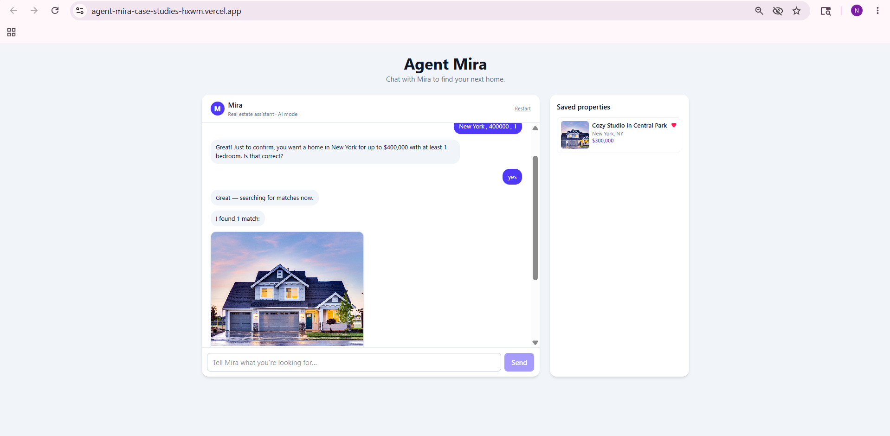

# Agent Mira — Case Study Submissions

Two independent case studies built for Agent Mira, both deployed to Vercel
(frontends) and Render (backends).

## 🔗 Live demos

| Case study | Live URL | Backend |
|---|---|---|
| **A — Property Price Comparator** | <https://agent-mira-case-studies.vercel.app/> | FastAPI on Render |
| **B — Real Estate Chatbot (AI mode)** | <https://agent-mira-case-studies-hxwm.vercel.app/> | Express on Render |

> ⏱️ **First request may take 30–60 s** — Render free-tier services sleep
> after 15 min idle and wake on demand.

---

## 📁 [Case Study A — Property Comparison & Price Prediction](./junior_case_study_package_v2/)

Compares two properties side-by-side and predicts each price using the
provided ML model.

- **Stack:** FastAPI (Python) + Vite + React + Tailwind
- **Highlights:** Custom unpickler for the provided model, mocked address
  data, side-by-side comparison view with diff highlight
- **Submission write-up:** [SUBMISSION.md](./junior_case_study_package_v2/SUBMISSION.md)

## 📁 [Case Study B — Real Estate Chatbot](./real_estate_chatbot/)

Chatbot that helps users find homes from three merged JSON sources, saves
favorites, and supports a free-form OpenAI NLP mode.

- **Stack:** Express (Node.js) + Vite + React + Tailwind + MongoDB (optional)
- **NLP bonus:** OpenAI structured outputs ("AI mode" badge in the header);
  graceful state-machine fallback when no API key is configured
- **Submission write-up:** [README.md](./real_estate_chatbot/README.md)

## Quick start (local)

Each sub-project has its own backend + frontend. Run one at a time (both
Vite dev servers default to port 5173). Detailed run instructions are in
each sub-project's README.

## Tooling notes

- Python 3.12+ for Case Study A
- Node.js 24+ for both
- No secrets are committed. `.env` files are gitignored; use the supplied
  `.env.example` as a template.
