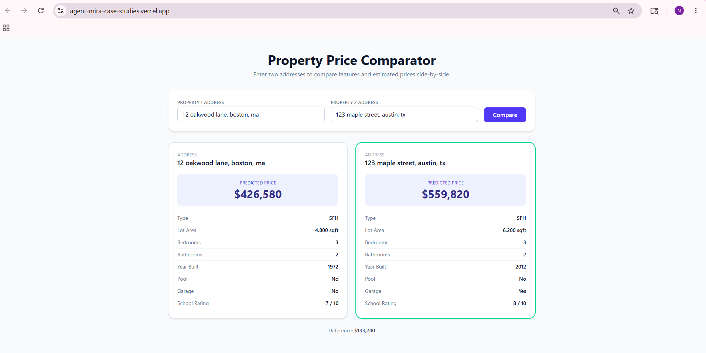

# Property Comparison & Price Prediction — Submission

A full-stack web app that compares two properties side-by-side and shows
predicted prices from the provided ML model.

## 🔗 Live demo

**<https://agent-mira-case-studies.vercel.app/>**

Backend: FastAPI deployed to Render (free tier — first request after
15 min idle takes ~30 s to wake).



*Example: comparing an older Boston SFH against a newer Austin SFH. The
emerald ring highlights the more expensive property; the diff is shown
below.*

## Stack

- **Backend:** Python 3.x + FastAPI + Uvicorn
- **Frontend:** Vite + React 19 + Tailwind CSS v4
- **Data:** Mocked address → feature lookup (case study explicitly allows
  mocked data in place of scraping)

## Project layout

```
junior_case_study_package_v2/
├── backend/
│   ├── main.py                       FastAPI app + ComplexTrapModelRenamed
│   ├── mock_data.py                  8 sample addresses + default fallback
│   ├── complex_price_model_v2.pkl    Provided pickle (unmodified)
│   └── requirements.txt
└── frontend/
    └── src/
        ├── App.jsx
        ├── api.js
        └── components/
            ├── AddressForm.jsx
            ├── PropertyCard.jsx
            └── ComparisonView.jsx
```

## Endpoints

- `GET /api/sample-addresses` — list of known mock addresses (used by the
  frontend `<datalist>` so reviewers can find working inputs).
- `POST /api/compare` — body `{address1, address2}`, returns features +
  `predicted_price` for both, with a `matched` flag indicating whether the
  address was found in the mock store (unknown addresses fall back to a
  deterministic default property so the demo never errors).

## The "trap" in the pickle

`complex_price_model_v2.pkl` is only **54 bytes**. Disassembling it with
`pickletools.dis` reveals it serializes a bare instance of
`__main__.ComplexTrapModelRenamed` with no state — there is no scikit-learn
estimator inside.

To deserialize, the class `ComplexTrapModelRenamed` must exist in the
unpickling environment. Two pieces make this work:

1. The class is defined at the top of [`backend/main.py`](backend/main.py)
   with a sensible feature-weighted `predict()` that honors the schema rule
   from [`model_interface.md`](model_interface.md) (use `lot_area` only for
   SFH, `building_area` only for Condo).
2. A `_CompatUnpickler` overrides `find_class` so the pickle's reference to
   `__main__.ComplexTrapModelRenamed` resolves to our class regardless of
   how the app is launched (uvicorn imports `main.py` as `main`, not
   `__main__`).

## Run locally

Two terminals.

**Terminal 1 — backend (port 8000):**

```powershell
cd junior_case_study_package_v2/backend
pip install -r requirements.txt
python -m uvicorn main:app --reload
```

**Terminal 2 — frontend (port 5173):**

```powershell
cd junior_case_study_package_v2/frontend
npm install
npm run dev
```

Open [http://localhost:5173](http://localhost:5173). Vite proxies `/api/*`
to the FastAPI backend (configured in [`vite.config.js`](frontend/vite.config.js)).

## Sample addresses to try

- `123 Maple Street, Austin, TX` — SFH
- `1600 Ocean Drive, Miami, FL` — Condo
- `88 Lakefront Way, Chicago, IL` — high-rated SFH
- `350 Fifth Avenue, New York, NY` — small Condo

Addresses are normalized (lowercase + collapsed whitespace) before lookup,
so case and extra spaces don't matter.

## Design notes

- **Single source of truth for features.** The mock store holds all 9
  schema fields per address. The frontend renders `lot_area` for SFH and
  `building_area` for Condo, matching the model's conditional rule.
- **Graceful unknown-address handling.** Unknown addresses fall back to a
  fixed default property rather than 404-ing — keeps the demo flow smooth.
  A small amber notice appears on the card.
- **Side-by-side highlight.** The higher-priced card gets an emerald ring;
  the diff is shown below.
